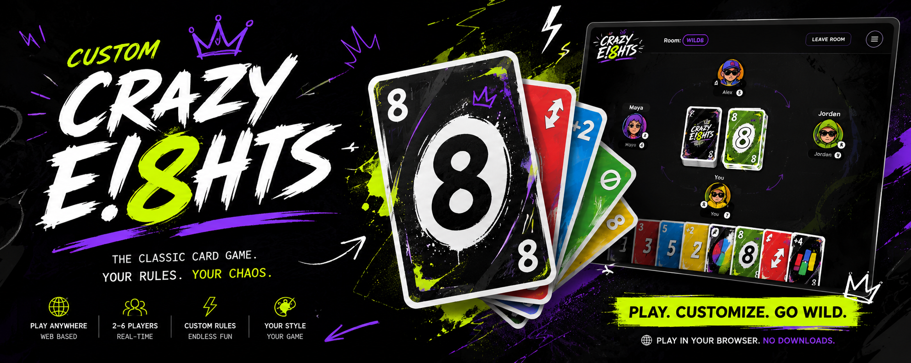

# 🎴 Very Crazy Eights

A chaotic, strategic, and occasionally cruel Kenyan-street-rules card game — a close cousin of *Kadi*, built on Crazy Eights bones. Rules vary from crew to crew; the rules below are **this house's defaults**, and the app lets the room host toggle the contentious ones (marked ⚙️).

**v1.0.0** — play in the browser: solo against bots, or online with friends — no accounts, just a nickname and a room code. Installable as an app (PWA), works offline against bots.

## Objective

Be the first player to empty your hand — or be the last one standing after everyone else busts out at 15 cards.

## Setup

- **Deck:** 54 cards — a standard 52 plus 2 Jokers.
- **Players:** 2–6.
- Deal **5 cards** each (**7** in a two-player game).
- The rest becomes the face-down **draw pile**.
- Flip the top card of the draw pile to start the **discard pile**. If it's a power card (2, 3, 8, J, K, Joker, or the A♠), bury it mid-pile and flip again until a plain card shows. (Q and the aces other than A♠ are plain cards in this variant.)
- The player left of the dealer goes first. Play moves **clockwise**.

## On your turn

Exactly one of three situations applies:

1. **Normal turn** — play one card that matches the top of the discard pile by **suit or rank**, or a wild (see *Spades* and *Jokers*). If you can't play, draw.
2. **Under attack** — a draw stack is aimed at you. Counter it or eat it (see *Draw stacks*).
3. **Facing a question** — an uncovered 8 sits on the pile. Cover it or draw 1 (see *The 8*).

**Drawing on a normal turn:** draw one card at a time until you draw a playable card — which you must then play — or until your hand hits **15 cards**.

**Busting:** the moment your hand reaches 15 cards you are **eliminated**, and your cards leave the game. Exception ⚙️: if the 15th card you draw is itself playable, you play it and survive. If everyone else busts, the last survivor wins the round.

You may not draw voluntarily while holding a playable card ⚙️.

## Card powers

| Card | Effect | Stackable? |
|------|--------|:----------:|
| **2** | Next player draws 2 | ✅ |
| **3** | Next player draws 3 | ✅ |
| **Joker** | Next player draws 5; you declare the suit that play continues in. Playable on anything. | ✅ |
| **J** | Skips the next player | ❌ |
| **K** | Reverses direction of play. Against a draw stack: bounces the whole stack back at the attacker. Heads-up (2 players): you play again. | ❌ |
| **8** | Question card — must be covered (see below) | ❌ |
| **A♠** | Supercard (see below) | ❌ |
| **Any spade** | May be played on any card as a wild (see below) | — |
| **Q, other aces, everything else** | No effect — plain cards | — |

## Draw stacks — 2s, 3s and Jokers

When a draw card is played at you, choose one:

- **Stack** — play any 2, 3, or Joker from your hand (no suit/rank match required ⚙️). Its value adds to the running total and the whole stack passes to the next player.
- **Bounce** — play any K (no match required). Direction reverses and the entire stack lands back on your attacker.
- **Cancel** — play any spade as a wild, or the A♠. The entire stack fizzles ⚙️.
- **Eat it** — draw the full total; your turn ends. Forced draws count toward the 15-card bust limit, so a big enough stack can eliminate you.

## The 8 — question cards

Playing an 8 is a question that demands an answer:

- After playing an 8 you must **immediately cover it** with one of: a card of the **same suit as the 8**, **another 8** (which then also needs covering — chains are legal), a **spade played as a wild**, or a **Joker**.
- The covering card's effect fires as normal — cover 8♥ with 2♥ and the next player is drawing 2.
- If you can't cover, **draw 1 card** and your turn ends. The uncovered 8 stays on top, and the next player faces the same question: cover it or draw 1. It keeps passing until someone answers it.
- You can't win on an uncovered 8 — if it's your last card, you'll be drawing.
- 8s are **not** wild in this variant.

## Spades — the wild suit

- **Any spade** may be played on **any** card. When you play one, you choose its role:
  - **As a wild:** declare the suit that play continues in. Its rank effect does *not* fire (an 8♠ played as a wild needs no covering). Played while under attack, it cancels the stack.
  - **As itself:** a normal spade — play continues in spades and its rank effect fires as usual (2♠ is a draw-2, K♠ reverses, and so on).
- **A♠ — the supercard.** Play it on anything. Either **declare both a suit and a rank** — the next player must match one of the two — or **cancel an entire draw stack** aimed at you.

## Winning a round

- First player to empty their hand wins the round.
- Your final card's effect still fires ⚙️ — finish on a Joker and your neighbour draws 5 straight into the scoring.
- ⚙️ **"Niko Kadi!"** (off by default): when enabled you must announce when you're down to your last card; slip up and it's a 2-card penalty.

## Scoring (optional, for multi-round games)

When a round ends, every other player scores penalty points for the cards left in their hand (busted players score the hand they busted with):

| Cards | Points |
|---|---|
| Joker | 50 |
| A♠ | 30 |
| 8 | 20 |
| K, Q, J | 10 |
| Aces (other than A♠) | 1 |
| Number cards | Face value |

Play rounds until someone crosses **100** points; the player with the **lowest** total wins the game.

## The app

- **Browser game + PWA** — installable on phone or desktop, plays offline against bots.
- **Online multiplayer** — peer-to-peer over WebRTC (PeerJS). The host's browser runs the authoritative game; friends join with a room code and a nickname. No accounts, no servers, no cost.
- **House rules** — the ⚙️ rules above are room settings chosen by the host.
- **Stack** — Vite + React + TypeScript. The rules engine is a pure, unit-tested module shared by bots, local play, and the multiplayer host.

### Run it locally

```bash
npm install
npm run dev      # dev server
npm test         # rules-engine test suite
npm run build    # production build in dist/
```

### Roadmap

- [x] Rules spec (this document)
- [x] Rules engine + tests (`src/engine`, run `npm test`)
- [x] Play vs bots (easy / normal / hard)
- [x] PWA (installable, offline vs bots)
- [x] Online rooms via PeerJS (host-authoritative, room codes, no accounts)
- [x] Polish: SVG card faces, tap-to-select, card animations, synthesized sounds
- [ ] Next: share-link rooms, connection status, host-drop recovery, fuller a11y

### Deploying (free, via GitHub Pages)

1. Activate the deploy workflow: move [`deploy/github-pages.yml`](deploy/github-pages.yml)
   to `.github/workflows/deploy.yml` (via the GitHub **Actions → New workflow**
   UI, or a local push with a `workflow`-scoped token). It lives outside
   `.github/workflows/` in the repo because pushing workflow files needs that
   extra token scope.
2. In the repo: **Settings → Pages → Build and deployment → Source: GitHub Actions**.
3. Every push to `main` then builds and publishes to
   `https://<your-user>.github.io/Crazy-Eights/`.

Online play is peer-to-peer: the host's browser runs the game and friends
connect straight to it with a room code — there's no server to run or pay for.
The only shared infrastructure is PeerJS's free public broker, which just
introduces players to each other.
